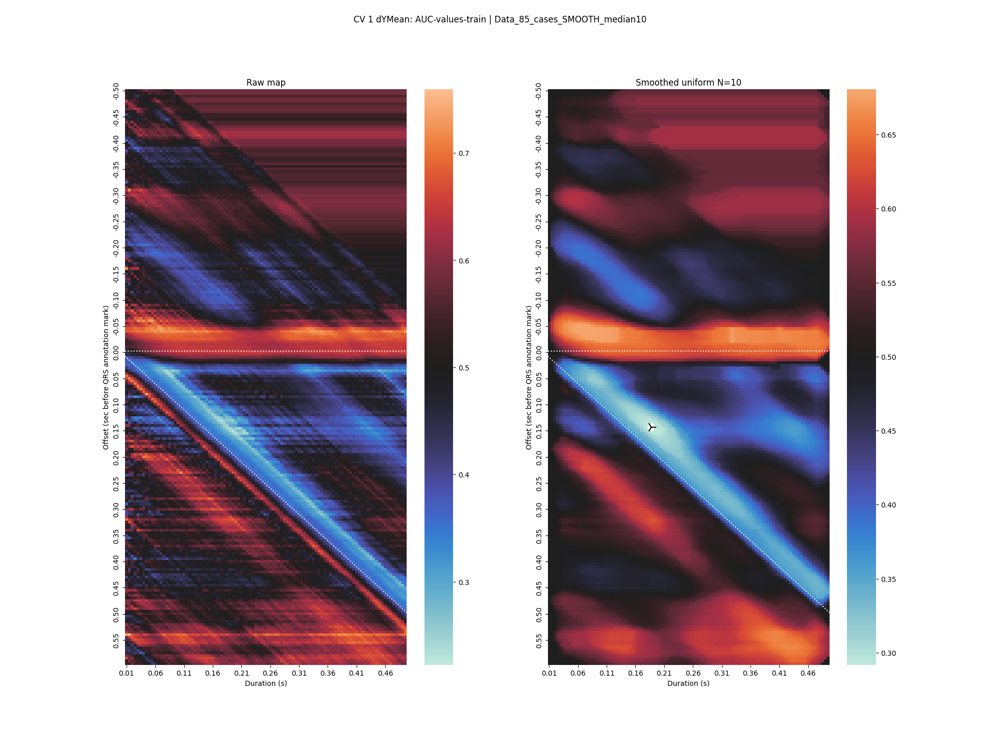
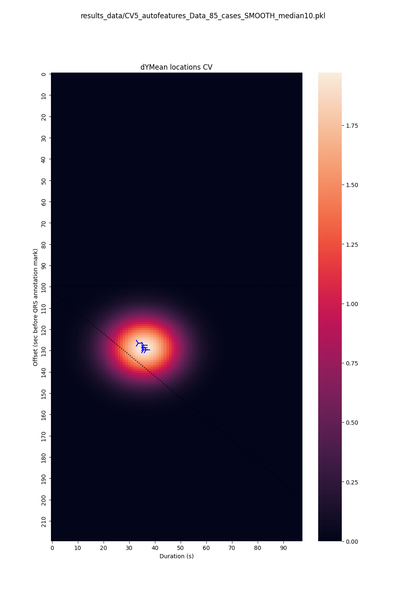
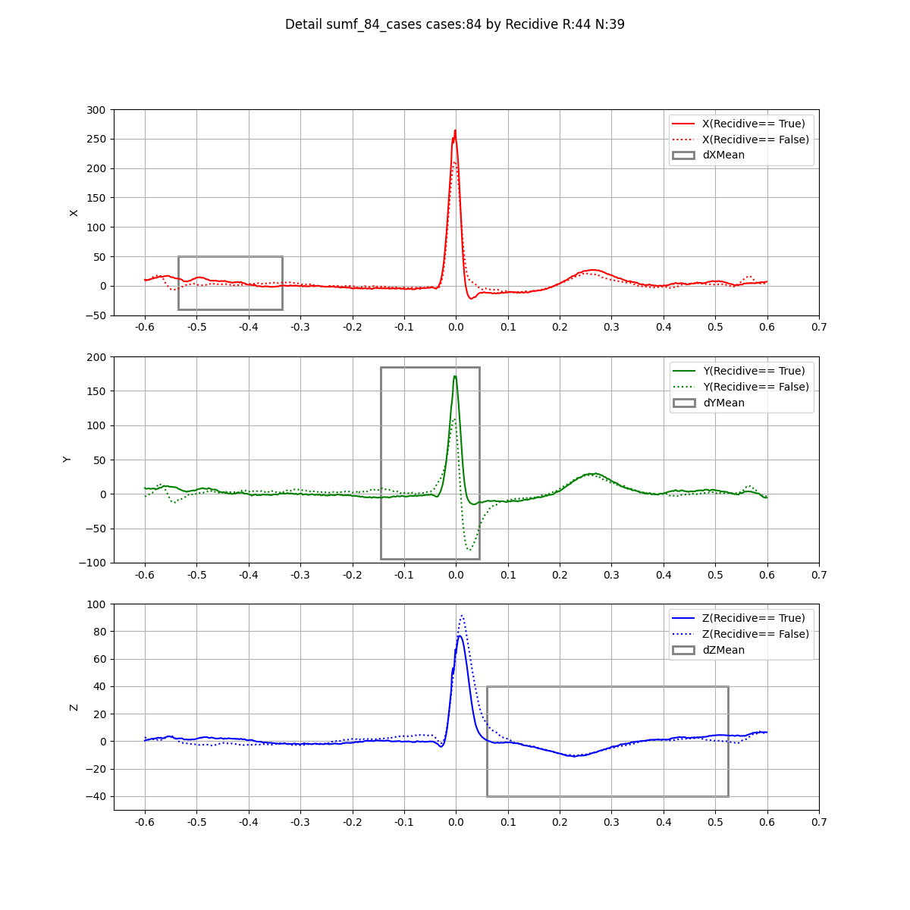
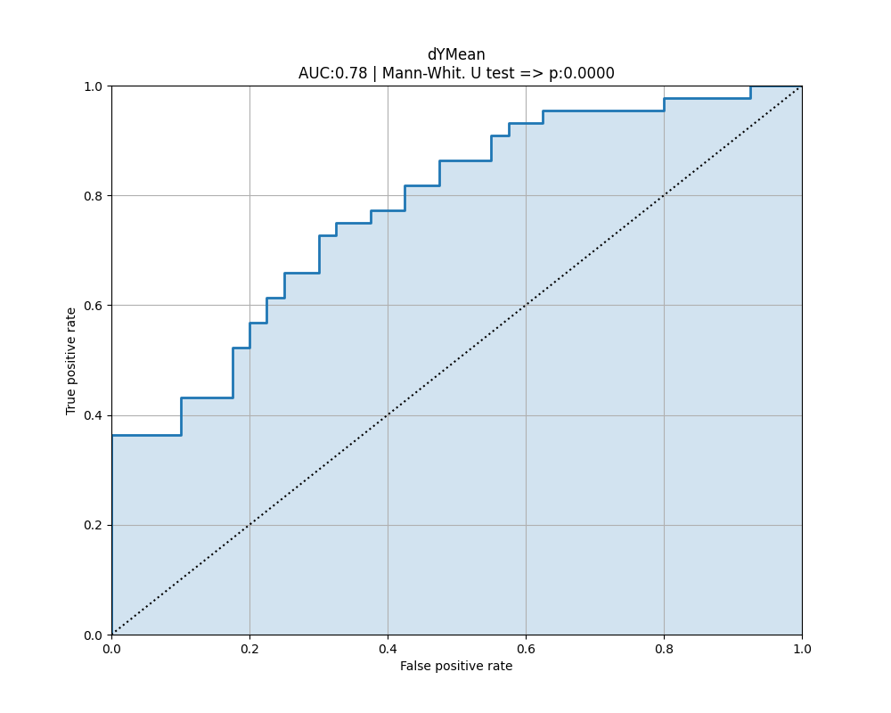

# An automated approach to optimize working windows for VCG features 

This archive contains all computational steps used to produce results in the upcoming paper: 
**Automatically Optimized Vectorcardiographic Features are Associated with Recurrence of Atrial Fibrillation after Electrical Cardioversion** (under revision now).

Although we made codes publically available, we are not authorized to publish source ECG and clinical data (provided codes cannot produce results without input data).

However, all computational code is included, and we added results of several steps if these results did not contain single subject-specific data.
Therefore, sub-folders like **figs_maps** contain all generated maps, including raw and smoothed versions as well. 
It also contains the final KDE maps and the raw form of generated tables before being formatted in MS Excel (folder **results_data**).
The subfolder **results** contains other raw images used in the paper (usually after processing in Adobe Illustrator).

We had to manually fix few mistakes in recordings (pairing between data tables and files). However, these fixes used sensitive information, and we had to anonymize these lines of code in four files before publishing. These places are commented on and contain the keyword "ANONYMIZED" in the commented block.  

## Description of included code files

The following table shows all computation sub-steps and their description. These sub-steps should be run consecutively because most produce results
for the following step. Essential steps (the topic of the paper) are **bold**, and steps built just for our further insight are _italic_. 
When description refers to a Figure, it means it was exported as an SVG/PNG file, improved for visual appearance in Adobe Illustrator, and exported for the manuscript as a raster image.  

| Script name                                                                            | Description                                                                                                                                                                                                      |
|----------------------------------------------------------------------------------------|------------------------------------------------------------------------------------------------------------------------------------------------------------------------------------------------------------------|
| _Preprocessing and conversion:_                                                        |                                                                                                                                                                                                                  |
| [step_0_read_and_convert_data.py](step_0_read_and_convert_data.py)                     | Build single dataset from available patient ECGs and Outcome files                                                                                                                                               |
| [step_1_detectQRS_buildAVG_shape.py](step_1_detectQRS_buildAVG_shape.py)               | Detects QRS and builds averaged QRS for each file. The code refers to the detection model in ONNX format, which is not provided since it was exclusively licensed to a private company.                          | 
| [step_2_convert_to_XYZ.py](step_2_convert_to_XYZ.py)                                   | Converts averaged QRS into VCG using Korrs matrix                                                                                                                                                                |  
| [step_3_dur_area_features_UPG.py](step_3_dur_area_features_UPG.py)                     | Computes basic features as QRS Area etc.                                                                                                                                                                         |
| _[step_4-5_basic_analysis.py](step_4-5_basic_analysis.py)_                             | _Basic analysis during development (not essential)_                                                                                                                                                              |
| _Core methods for **feature windows optimization:**_                                   |                                                                                                                                                                                                                  |
| **[step_6_build_matrices.py](step_6_build_matrices.py)**                               | **Builds 3D matrices for every feature as separate .npy files**                                                                                                                                                  |
| **[step_7_analyze_using_CV.py](step_7_analyze_using_CV.py)**                           | **Generates feature window maps as PNG files and detects optimal points in 5-fold CV** (used in Fig. 3. Figure axes are labeled incorrectly here)   |
| **[step_8_KDE_from_CV.py](step_8_KDE_from_CV.py)**                                     | **Generates aka Kernel-Density-Estimates to find optimal window** (used in Fig. 3 and Fig. 6. Figure axes are labeled incorrectly here)                                                       |
| _Methods to generate **result tables** and additional images:_                          |                                                                                                                                                                                                                  |
| [step_9_gen_AVG_VCG_images.py](step_9_gen_AVG_VCG_images.py)                           | Renders average ECG with found optimal windows (used in Fig. 1, Fig. 5)                                                                                                            |
| [step_10_boxplots.py](step_10_boxplots.py)                                             | Renders boxplots and AUC graphs (used in Fig. 4, Fig .5)                                                                                                                                      |
| _[step_11_draw_ECG_images.py](step_11_draw_ECG_images.py)_                             | _Renders standard ECG graphs for each patient (not essential)_                                                                                                                                                   |
| [step_12_compare_clin_feas_and_computed.py](step_12_compare_clin_feas_and_computed.py) | Generates results comparing performance of computed and clinical features. This step also evaluates correlations (values later used in Fig.4)                                                                    |

Contact: fplesinger at isibrno.cz
